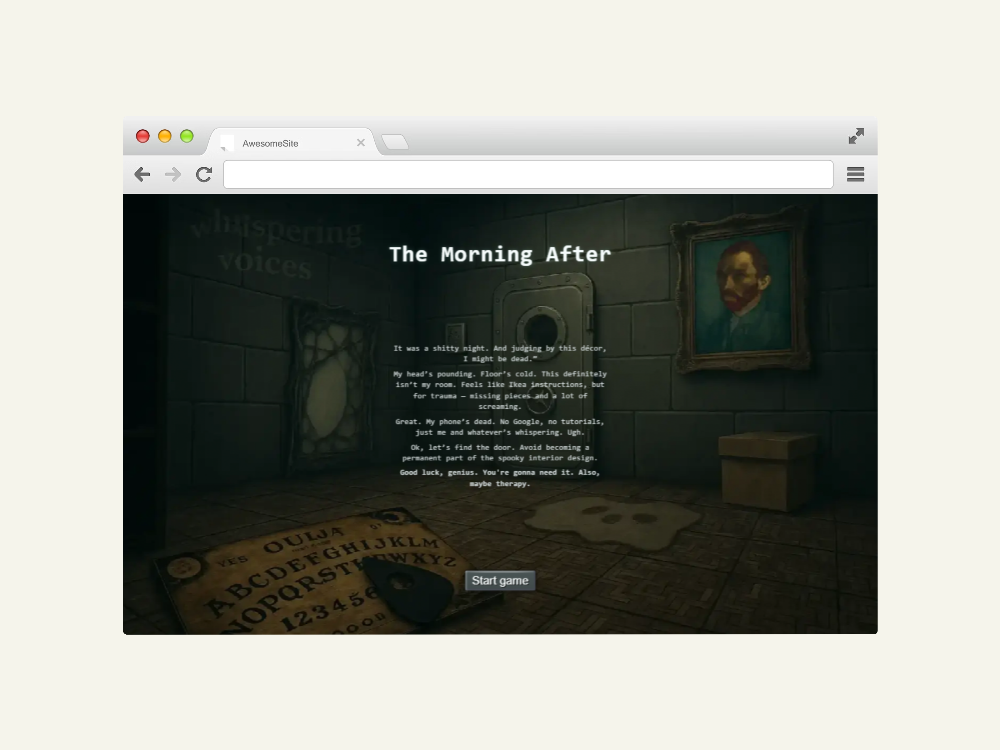
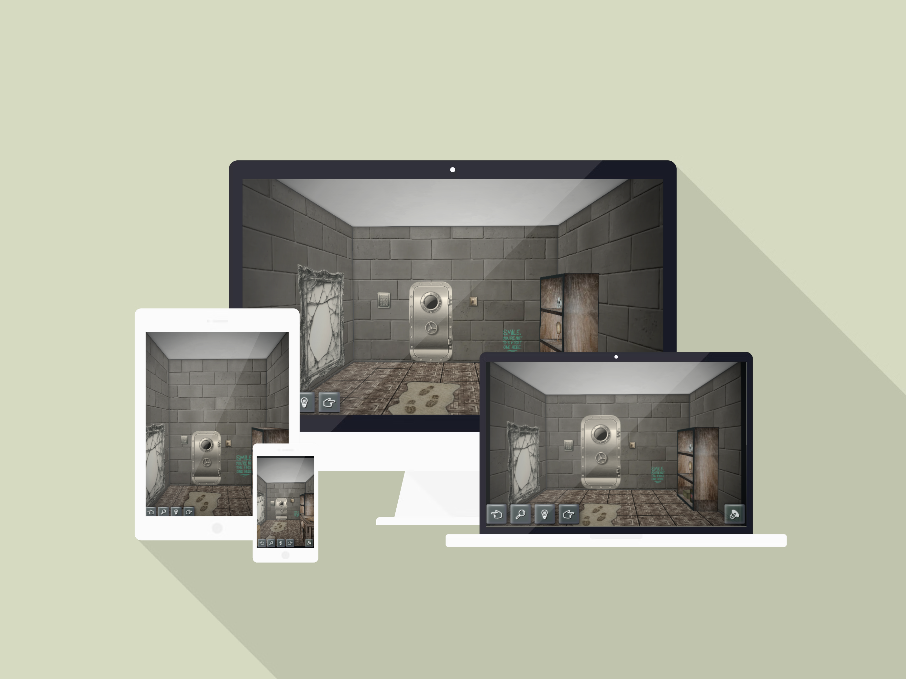
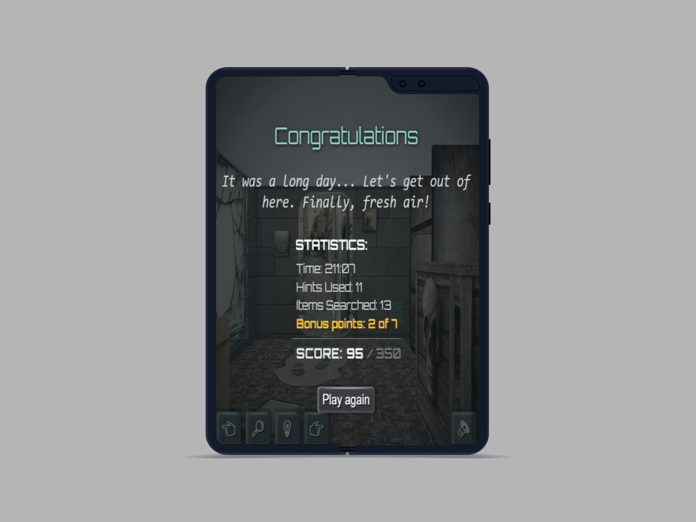

# 🔐 Escape Room Game

An immersive React-based escape room game featuring atmospheric audio, interactive puzzles, and a mysterious storyline. Navigate through a dark room using clues and solving riddles to find your way out.

## ✨ Features

- **360° Room Navigation** - Turn left/right to explore different walls
- **Atmospheric Audio System** - Dynamic ambient sounds and random horror effects
- **Interactive Puzzles** - Click on objects to gather clues and solve riddles
- **Progressive Gameplay** - Light/dark mechanics affect audio and atmosphere
- **Mobile-Friendly** - Touch controls, vibration feedback, and responsive design
- **Accessibility** - Screen reader support and keyboard navigation
- **Game Statistics** - Track completion time, hints used, and easter eggs found

## 🖼️ Mockups & Screenshots

- **Overview / Start**  
  
- **Game**  
  

- **UI Fragments**  
  

---

## 🎧 Audio System

The game features a sophisticated audio system with multiple layers:

### Ambient Audio

- Plays automatically when lights are turned off (after first interaction)
- Stops immediately when lights are turned on
- Respects mute settings

### Random Spooky Sounds

- Different probability based on lighting:
  - **Lights ON**: 65% chance every 30 seconds
  - **Lights OFF**: 20% chance every 30 seconds
- Includes various horror effects (voices, steps, laughter, etc.)

### Interactive Sounds

- Switch clicking sounds (preloaded for immediate response)
- Item interaction feedback
- Door and lock sounds
- Sequence-based audio for complex interactions

### Mute Functionality

- Global mute toggle (M key or button)
- Preserves user preference in localStorage
- Stops all audio types when enabled

## 🎮 Game Mechanics

### Light System

- **Dark Room**: Enhanced ambient audio, fewer random sounds
- **Lit Room**: No ambient audio, more frequent random sounds
- Flickering effect when switching lights

### Puzzle Elements

- **OUIJA Board**: Provides cryptic instructions and riddles
- **Code Lock**: 6-digit combination required to escape
- **Collectible Clues**: Hidden throughout room objects
- **Easter Eggs**: 7 hidden secrets for bonus points

### Navigation

- **Mouse/Touch**: Drag to look around with tilt effects
- **Keyboard**: Arrow keys for turning, M for mute
- **Mobile**: Swipe gestures and haptic feedback

## 🧱 Technical Implementation

### Architecture

```bash

src/
├── components/           # Main game components
│   ├── Room.js          # Main game container
│   ├── Room.css         # Room styling
│   ├── AudioController.js # Audio management
│   ├── CodeLock.js      # Final puzzle interface
│   ├── CodeLock.css     # Lock interface styling
│   ├── RoomNavigation.js # Control buttons
│   ├── RoomNavigation.css # Navigation styling
│   ├── WinScreen.js     # Ending screen
│   ├── WinScreen.css     # Ending screen styling
│   ├── StartScreen.js     # Start screen
│   ├── StartScreen.css     # Start screen styling
│   ├── GhostComponent.js # Ghost effects
│   ├── GhostComponent.css # Ghost styling
│   ├── Table.js         # Table with OUIJA
│   ├── Table.css         # Table styling
│   ├── Shelf.js         # Object shelf
│   ├── Shelf.css         # Shelf styling
│   └── Cardbox.js       # Cardboard box component
│   └── Cardbox.css       # Cardboard box component styling
├── wall-components/     # Room wall elements
│   ├── BackWall.js      # Light switch, door, lock
│   ├── BackWall.css     # Wall styling
│   ├── LeftWall.js      # Shelf with objects
│   ├── LeftWall.css     # Left wall styling
│   ├── RightWall.js     # Mirror, poster
│   ├── RightWall.css    # Right wall styling
│   ├── FrontWall.js     # Painting
│   ├── FrontWall.css    # Front wall styling
│   ├── Floor.js         # Floor interactions
│   ├── Floor.css        # Floor styling
│   ├── Ceiling.js       # Ceiling lighting
│   └── Ceiling.css      # Ceiling styling
├── hooks/
│   ├── useSetAudio.js   # Audio management hook
│   └── useTilt.js       # Mouse tilt effects
├── sounds/              # Audio assets
└── img/                 # Visual assets and textures
```

### Audio Performance Optimizations

- **Preloading**: Critical sounds (switch) loaded immediately
- **Lazy Loading**: Random sounds loaded on demand
- **Memory Management**: Automatic cleanup of audio instances
- **Cache System**: Reuse audio objects to reduce memory usage

### State & Persistence

- Progress and stats in `localStorage`.
- Tracked: time, hints, searched items, easter eggs, total score.

---

## 🛠️ Installation & Development

```bash
# Clone
git clone <repo-url>
cd escape-room

# Install
npm install

# Dev
npm start

# Production build
npm run build

### State Management

- Game state persisted in localStorage
- Statistics tracking (time, hints, items clicked)
- Progress preservation across sessions

## Controls

### Desktop

- **Mouse**: Look around, click objects
- **Arrow Keys**: Turn left/right
- **M Key**: Toggle mute
- **Click + Drag**: Tilt view for immersion

### Mobile

- **Touch**: Tap objects, swipe to turn
- **Vibration**: Haptic feedback on interactions
- **Responsive UI**: Optimized for touch devices

## Gameplay Tips

### Getting Started

- Turn on the lights to see all clues using the wall switch to begin exploring
- Click on objects throughout the room to gather clues
- Use the OUIJA board for cryptic instructions about solving puzzles
- Look for the paper with the key sequence in the cardboard box
- Find numerical clues hidden in various room objects
- Combine the numbers according to the OUIJA's and KEY's instructions
- Enter the final code in the door lock to escape

### Helpful Hints

- Explore all walls and objects thoroughly
- Pay attention to numbers and sequences mentioned in object descriptions
- The OUIJA board provides crucial instructions for combining clues
- References span literature, pop culture, science, and anatomy
- Look for connections to famous dates, songs, books, and scientific discoveries
- The hint system provides themed clues pointing to specific puzzle categories
- Some puzzles require knowledge of astronomy, biology, and cultural references
- Use the hint system if you get stuck (affects your final score)

## Installation & Development

### Prerequisites

- Node.js 16+
- React 18+
- Modern browser with audio support

### Setup

```bash

# Clone repository
git clone [repository-url]
cd escape-room

# Install dependencies
npm install

# Start development server
npm start

# Build for production
npm run build

```

### Audio Assets

Ensure all audio files are properly placed in `src/sounds/` directory. The game expects specific file formats and names for proper functionality.

## 🌐 Browser Compatibility

- **Chrome/Edge**: Full support including vibration
- **Firefox**: Full support
- **Safari**: Full support with iOS touch optimizations
- **Mobile Browsers**: Touch controls and responsive design

## ⚡ Performance Considerations

- Audio files are optimized for web delivery
- Critical path audio is preloaded
- Efficient state management prevents unnecessary re-renders
- Memory cleanup prevents audio leaks

## 🤝 Contributing

When modifying the audio system:

1. Maintain mute functionality across all sound types
2. Preserve original light switch behavior
3. Test performance with multiple audio instances
4. Ensure mobile compatibility

---

Built with React, featuring immersive audio design and responsive gameplay mechanics.

## 📬 Contact

✉️ Email: [mailto:alenapumprova@seznam.cz](mailto:alenapumprova@seznam.cz)

💼 LinkedIn: linkedin.com/in/alena-pumprová

🐱 GitHub: github.com/Alena0490
# Escape-room


